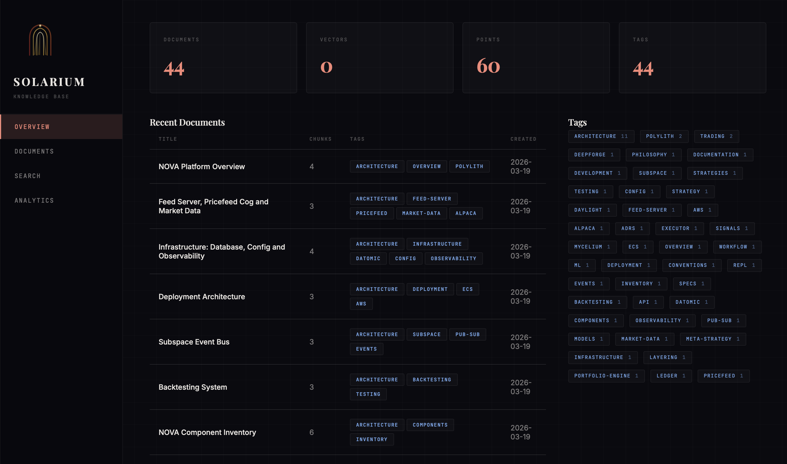

<p align="center">
  
</p>

# Solarium

A knowledge base MCP server backed by [Qdrant](https://qdrant.tech/) vector database with local embeddings ([nomic-embed-text-v1.5](https://huggingface.co/nomic-ai/nomic-embed-text-v1.5) via HuggingFace Transformers + ONNX Runtime).

Solarium runs as a local MCP server process — embeddings are computed on your machine, vectors are stored in a Qdrant instance of your choice (local or cloud).

## Setup

### Prerequisites

- Node.js 20+
- npm

### Install dependencies

```bash
cd solarium
npm install
```

### Build and link

```bash
npm run build
npm link
```

This builds the server and creates a global `solarium` command on your PATH.

### Run the solarium binary

```bash
solarium
```

### Pre-download the embedding model (optional but recommended)

The model (~130MB) is downloaded automatically on first use, but you can cache it ahead of time:

```bash
./bin/download-model.sh
```

### Configure your Qdrant instance

Set your Qdrant API key in your shell profile (`~/.zshrc` or `~/.bashrc`):

```bash
# Qdrant Cloud (Solarium)
export QDRANT_API_KEY=<your-qdrant-api-key>
```

Then reload your shell: `source ~/.zshrc`

### dd to your Claude Code MCP config

Add the following to `.mcp.json` in any repo where you want Solarium available:

```json
{
  "mcpServers": {
    "solarium": {
      "command": "solarium",
      "env": {
        "QDRANT_URL": "https://your-cluster.cloud.qdrant.io:6333"
      }
    }
  }
}
```

`QDRANT_API_KEY` is read from your shell environment automatically.

### Verify

In Claude Code, run `/mcp` to confirm Solarium is connected, then try:

> Search the knowledge base for "deployment architecture"

## Available Tools

| Tool | Description |
|------|-------------|
| `store_document` | Store a document (chunks and embeds for semantic search) |
| `search` | Semantic search across all documents |
| `list_documents` | List all documents with metadata |
| `read_document` | Read full document content by ID |
| `update_document` | Update content or metadata (re-embeds if content changes) |
| `delete_document` | Delete a document and all its chunks |
| `list_tags` | List all tags with counts |
| `tag_document` | Add tags to a document |
| `untag_document` | Remove tags from a document |

## Dashboard

Solarium includes a local web dashboard for browsing documents, semantic search, tag management, and analytics.

<p align="center">
  
</p>

### Build and run the dashboard

Reload your shell first.

```bash
npm run build:dashboard
solarium-dashboard
```

Then open `http://localhost:3333` in your browser.

The dashboard requires the same `QDRANT_URL` and `QDRANT_API_KEY` environment variables as the MCP server. Set `DASHBOARD_PORT` to change the port (default: 3333).

### Views

- **Overview** — collection stats (document/vector/point counts), recent documents, tag cloud
- **Documents** — paginated document list with tag filtering, full document detail with rendered markdown and chunk visualization, inline tag management (add/remove)
- **Search** — semantic search with relevance scores, snippets, and tag filtering
- **Analytics** — documents over time, tag distribution, chunk size distribution (Vega-Lite charts), collection stats

### Architecture

The dashboard runs as a separate process from the MCP server (which uses stdio). Both share the same source code — Qdrant client, tools, config, and embedding pipeline.

- **Server-driven rendering** — HTML is rendered on the server from ClojureScript hiccup, streamed to the browser
- **SSE + Idiomorph** — live updates via Server-Sent Events with DOM morphing (polls Qdrant every 60s)
- **Tailwind CSS** + `@tailwindcss/typography` — styling with the `prose` class for markdown content
- **Vega-Lite** — interactive charts, lazy-loaded from CDN only on the analytics page
- **No frontend framework** — no React, no client-side state management; ~30 lines of client JS for SSE wiring

## Configuration

All configuration is via environment variables:

| Variable | Default | Description |
|----------|---------|-------------|
| `QDRANT_URL` | `http://localhost:6333` | Qdrant server URL |
| `QDRANT_API_KEY` | _(none)_ | Qdrant API key (required for cloud) |
| `COLLECTION_NAME` | `knowledge` | Qdrant collection name |
| `MODEL_NAME` | `nomic-ai/nomic-embed-text-v1.5` | HuggingFace embedding model |
| `CHUNK_MAX_CHARS` | `1600` | Max characters per chunk |
| `CHUNK_OVERLAP` | `200` | Overlap between chunks |
| `DASHBOARD_PORT` | `3333` | Dashboard HTTP server port |

## Development

```bash
# Watch mode — MCP server
npm run watch

# Watch mode — dashboard
npm run watch:dashboard

# Watch both
npm run watch:all

# Run tests
npm test
```

Built with shadow-cljs (ClojureScript).
